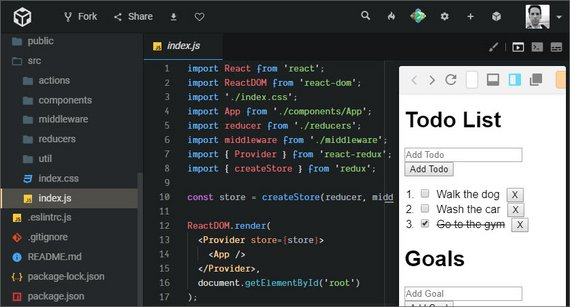
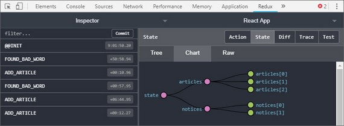
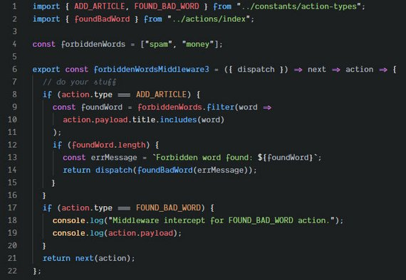
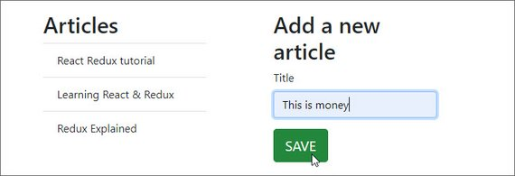
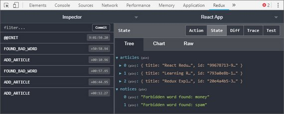

<!-- markdownlint-disable MD022 MD024 MD032 MD033 -->

# James Priest
<p class="toc"><a href="./index.html">&lt;– back to Table of Contents</a></p>

## 100 Days of Code

| Log 1 | Log 2 | Log 3 | Log 4 | Log 5 |
| --- | --- | --- | --- | --- |
| [Round 1](https://james-priest.github.io/100-days-of-code-log/) | [Round 2](https://james-priest.github.io/100-days-of-code-log-r2/) | [Round 3](https://james-priest.github.io/100-days-of-code-log-r3/) | [Round 4](https://james-priest.github.io/100-days-of-code-log-r4/) | this log |

## Challenge & Commitment
This is part of Alexander Kallaway's [100DaysOfCode](https://github.com/Kallaway/100-days-of-code "the official repo") challenge. More details about the challenge can be found here: [100daysofcode.com](http://100daysofcode.com/ "100daysofcode.com").

**Commitment:** *I will code daily for the next 100 days.*

|  Start Date   | End Date     |
| ------------- | ------------ |
| February 25, 2019  | - - - |

## Goals

- [x] Code daily
- [x] Successfully complete Udacity's [React Nanodegree](https://www.udacity.com/course/react-nanodegree--nd019) program

# Code Log

---

## 17. Redux Architecure
### Day 17: March 17, 2019 - Sunday

**Project:** [Udacity React Nanodegree Program](https://www.udacity.com/course/react-nanodegree--nd019)

[](assets/images/day16.jpg)<br>
**Live Demo:** [React Redux Todo Goals App](https://codesandbox.io/s/github/james-priest/reactnd-redux-todos-goals-cra) on CodeSandbox

**Progress:** Continued Udacity Redux lesson for my React Nanodegree Program.

I spent the day reading through a handful of key articles that detailed how to best organize and manage code related to large-scale Redux applications.

This was very eye opening. It included the following topics.

- Normalizing data before use
- Storing data with an index and accessing it with selectors
- Keeping canonical data (data from the DB or API) separate from UI state data
- Splitting the store into sub-stores & using slice reducers
- Other best practices for connecting React components to Redux state

You can read more in my notes: [Udacity React & Redux - 6.7 Redux Architecture](https://james-priest.github.io/udacity-nanodegree-react/course-notes/react-redux.html#67-redux-architecture)

**Links:**
- Redux Docs - [Organizing State](https://redux.js.org/faq/organizing-state)
- Redux Docs - [Normalizing State Shape](https://redux.js.org/recipes/structuring-reducers/normalizing-state-shape)
- Medium - [Redux for state management in large web apps](https://blog.mapbox.com/redux-for-state-management-in-large-web-apps-c7f3fab3ce9b) - Sub-stores, slice reducers, data structures with [Immutable-js library](https://facebook.github.io/immutable-js/), and selector functions
- Medium - [Five Tips for Working with Redux in Large Applications](https://techblog.appnexus.com/five-tips-for-working-with-redux-in-large-applications-89452af4fdcb) - Data indexes, separate canonical and UI state, and selectors functions.
- egghead.io - [Getting Started with Redux](https://egghead.io/courses/getting-started-with-redux) - Comprehensive video tutorial series on Redux by Dan Abramov.
- egghead.io - [Building React Applications with Idiomatic Redux](https://egghead.io/courses/building-react-applications-with-idiomatic-redux) - Part 2 of Dan Abramov's EXCELLENT video tutorial series.
- Course notes - [Udacity React & Redux](https://james-priest.github.io/udacity-nanodegree-react/course-notes/react-redux.html#react--redux)
- Link to [Udacity React Nanodegree Program](https://www.udacity.com/course/react-nanodegree--nd019)

---

## 16. Redux Folder Structure
### Day 16: March 16, 2019 - Saturday

**Project:** [Udacity React Nanodegree Program](https://www.udacity.com/course/react-nanodegree--nd019)

[](assets/images/day16.jpg)<br>
**Live Demo:** [React Redux Todo Goals App](https://codesandbox.io/s/github/james-priest/reactnd-redux-todos-goals-cra) on CodeSandbox

**Progress:** Continued Udacity Redux lesson for my React Nanodegree Program.

This lesson was showed how to organize and structure a React Redux app using the [Rails-style pattern](https://redux.js.org/faq/code-structure) folder structure.

This splits files according to function with these folders.

- actions
- constants
- reducers
- containers
- components

The exercise involved splitting all existing code for my Todo & Goals app according to this structure.

You can read more in my notes: [Udacity React & Redux - 6.5 Folder Structure](https://james-priest.github.io/udacity-nanodegree-react/course-notes/react-redux.html#66-folder-structure)

**Links:**
- Live Demo - [React Redux Todo Goals App](https://codesandbox.io/s/github/james-priest/reactnd-redux-todos-goals-cra) on CodeSandbox
- Repo - [React Redux Todos & Goals App](https://github.com/james-priest/reactnd-redux-todos-goals-cra) on GitHub
- Course notes - [Udacity React & Redux](https://james-priest.github.io/udacity-nanodegree-react/course-notes/react-redux.html#react--redux)
- Link to [Udacity React Nanodegree Program](https://www.udacity.com/course/react-nanodegree--nd019)

---

## 15. React Redux Bindings
### Day 15: March 15, 2019 - Friday

**Project:** [Udacity React Nanodegree Program](https://www.udacity.com/course/react-nanodegree--nd019)

[](assets/images/day15.jpg)<br>
**Live Demo:** [React Redux Todo Goals App](https://codesandbox.io/s/github/james-priest/reactnd-redux-todos-goals-cra) on CodeSandbox

**Progress:** Continued Udacity Redux lesson for my React Nanodegree Program.

This lesson was about implementing the `react-redux` library to provide an efficient way to pass a Redux store to our React components.

This included

- Importing the `react-redux` library
- Wrapping `App` with Provider and passing in the store
- Using `connect()` to map state & dispatch to props and then passing in the component we want to connect the redux store to.

You can read more in my notes: [Udacity React & Redux - 6.5 react-redux Bindings](https://james-priest.github.io/udacity-nanodegree-react/course-notes/react-redux.html#64-build-custom-connect)

**Links:**
- Live Demo - [React Redux Todo Goals App](https://codesandbox.io/s/github/james-priest/reactnd-redux-todos-goals-cra) on CodeSandbox
- Repo - [React Redux Todos & Goals App](https://github.com/james-priest/reactnd-redux-todos-goals-cra) on GitHub
- Course notes - [Udacity React & Redux](https://james-priest.github.io/udacity-nanodegree-react/course-notes/react-redux.html#react--redux)
- Link to [Udacity React Nanodegree Program](https://www.udacity.com/course/react-nanodegree--nd019)

---

## 14. Connected Components
### Day 14: March 14, 2019 - Thursday

**Project:** [Udacity React Nanodegree Program](https://www.udacity.com/course/react-nanodegree--nd019)

[](https://james-priest.github.io/udacity-nanodegree-react/assets/images/rr47.jpg)<br>
**Live Demo:** [Context API Todo Goals App](https://codesandbox.io/s/l5m5n58rx7?fontsize=14) on CodeSandbox

**Progress:** Continued Udacity Redux lesson for my React Nanodegree Program.

This lesson had us write code to replicate the functionality from `react-redux`.

This included

- Creating a Connected component to wrap a Provider
- Writing a connect method
- Ensuring connect is capable of being passed a function and currying a component for composition

You can read more in my notes: [Udacity React & Redux - 6.3 Add Context to Todos](https://james-priest.github.io/udacity-nanodegree-react/course-notes/react-redux.html#63-add-context-to-todos)

**Links:**
- Live Demo - [Context API Todo Goals App](https://codesandbox.io/s/l5m5n58rx7?fontsize=14) on CodeSandbox
- Repo - [Redux Todos & Goals App](https://github.com/james-priest/reactnd-redux-todos-goals/tree/master) on GitHub
- Course notes - [Udacity React & Redux](https://james-priest.github.io/udacity-nanodegree-react/course-notes/react-redux.html#react--redux)
- Link to [Udacity React Nanodegree Program](https://www.udacity.com/course/react-nanodegree--nd019)

---

## 13. React Context API
### Day 13: March 13, 2019 - Wednesday

**Project:** [Udacity React Nanodegree Program](https://www.udacity.com/course/react-nanodegree--nd019)

[](https://james-priest.github.io/udacity-nanodegree-react/assets/images/rr48.jpg)<br>
**Live Demo:** [Context API Todo Goals App](https://codesandbox.io/s/l5m5n58rx7?fontsize=14) on CodeSandbox

**Progress:** Continued Udacity Redux lesson for my React Nanodegree Program.

This lesson covered the use of React's Context API which gives deeply nested components access to props without having to pass them all the way down the hierarchy.

It uses:

- Declarative syntax
- `<Context.Provider>` to accept data which is to be passed to a consumer component
- `<Context.Consumer>` which accepts a child function that provides access to the data and returns JSX.

```jsx
// Provider
class App extends React.Component {
  render() {
  const name = 'Tyler';

  return (
    <Context.Provider value={name}>
      <Parent />
    </Context.Provider>
    );
  }
}

// Consumer
function Grandchild ({ name }) {
  return (
    <Context.Consumer>
      {(name) => (
        <div>
          <h1>Grandchild</h1>
          <h3>Name: {name}</h3>
        </div>
      )}
    </Context.Consumer>
  );
}
```

You can read more in my notes: [Udacity React & Redux - 6.2 React's Context API](https://james-priest.github.io/udacity-nanodegree-react/course-notes/react-redux.html#62-reacts-context-api)

**Links:**
- Live Demo - [Context API Todo Goals App](https://codesandbox.io/s/l5m5n58rx7?fontsize=14) on CodeSandbox
- Repo - [Redux Todos & Goals App](https://github.com/james-priest/reactnd-redux-todos-goals/tree/master) on GitHub
- Course notes - [Udacity React & Redux](https://james-priest.github.io/udacity-nanodegree-react/course-notes/react-redux.html#react--redux)
- Link to [Udacity React Nanodegree Program](https://www.udacity.com/course/react-nanodegree--nd019)

---

## 12. Redux Thunk
### Day 12: March 11, 2019 - Monday

**Project:** [Udacity React Nanodegree Program](https://www.udacity.com/course/react-nanodegree--nd019)

[](https://james-priest.github.io/udacity-nanodegree-react/assets/images/rr45.jpg)<br>
**Live Demo:** [Async Redux Todo Goals App](https://codesandbox.io/s/0pkwq6o26l?fontsize=14) on CodeSandbox

**Progress:** Continued Udacity Redux lesson for my React Nanodegree Program.

This lesson covered the use of redux-thunk  middleware which allows us to run business logic and/or asynchronous code from our action creators.

This provides the following benefits:

- Cleaner separation between UI logic & data fetching logic.
- Ability to run async code, dispatch other actions, or update the action object prior to submitting the action to the reducer.

Redux middleware sits between the dispatch of an action and the running of the reducer. redux-thunk inspects what is returned from the action creator and passes it to reducer if it is an object. If it's a function then it invokes the function before finally passing the final object to the reducer.

You can read more in my notes: [Udacity React & Redux - 5.4 Thunk](https://james-priest.github.io/udacity-nanodegree-react/course-notes/react-redux.html#54-thunk)

**Links:**
- Live Demo - [Async Redux Todo Goals App](https://codesandbox.io/s/0pkwq6o26l?fontsize=14) on CodeSandbox
- Repo - [Redux Todos & Goals App](https://github.com/james-priest/reactnd-redux-todos-goals/tree/master) on GitHub
- Course notes - [Udacity React & Redux](https://james-priest.github.io/udacity-nanodegree-react/course-notes/react-redux.html#react--redux)
- Link to [Udacity React Nanodegree Program](https://www.udacity.com/course/react-nanodegree--nd019)

---

## 11. Redux Optimistic Updates
### Day 11: March 10, 2019 - Sunday

**Project:** [Udacity React Nanodegree Program](https://www.udacity.com/course/react-nanodegree--nd019)

[](https://james-priest.github.io/udacity-nanodegree-react/assets/images/rr43.jpg)<br>
**Live Demo:** [Async Redux Todo Goals App](https://codesandbox.io/s/0pkwq6o26l?fontsize=14) on CodeSandbox

**Progress:** Continued Udacity Redux lesson for my React Nanodegree Program.

This lesson covered using both optimistic and pessimistic updates to the database.

- An optimistic update modifies the Redux store prior to getting a successful confirmation back from the database.
- Pessimistic updates will only update the Redux store upon the return of a successful async request.

The reason to use optimistic updates is to provide a better UX. This updates the UI immediately when a user initiates an action rather than waiting until a response is returned.

You can read more in my notes: [Udacity React & Redux - 5.3 Optimistic Updates](https://james-priest.github.io/udacity-nanodegree-react/course-notes/react-redux.html#53-optimistic-updates)

**Links:**
- Live Demo - [Async Redux Todo Goals App](https://codesandbox.io/s/0pkwq6o26l?fontsize=14) on CodeSandbox
- Repo - [Redux Todos & Goals App](https://github.com/james-priest/reactnd-redux-todos-goals/tree/master) on GitHub
- Course notes - [Udacity React & Redux](https://james-priest.github.io/udacity-nanodegree-react/course-notes/react-redux.html#react--redux)
- Link to [Udacity React Nanodegree Program](https://www.udacity.com/course/react-nanodegree--nd019)

---

## 10. Asynchronous Redux
### Day 10: March 9, 2019 - Saturday

**Project:** [Udacity React Nanodegree Program](https://www.udacity.com/course/react-nanodegree--nd019)

[](https://james-priest.github.io/udacity-nanodegree-react/assets/images/rr41.jpg)<br>
**Live Demo:** [Async Redux Todo Goals App](https://codesandbox.io/s/0pkwq6o26l?fontsize=14) on CodeSandbox

**Progress:** Continued Udacity Redux lesson for my React Nanodegree Program.

This lesson introduced async operation handling in Redux. This covered:

- Fetching the request in `componentDidMount()`
- Creating a new receiveDataAction method
- Dispatching then method when data is received

You can read more in my notes: [Udacity React & Redux - 5.1 Asynchronous Redux](https://james-priest.github.io/udacity-nanodegree-react/course-notes/react-redux.html#5-asynchronous-redux)

**Links:**
- Live Demo - [Async Redux Todo Goals App](https://codesandbox.io/s/0pkwq6o26l?fontsize=14) on CodeSandbox
- Repo - [Redux Todos & Goals App](https://github.com/james-priest/reactnd-redux-todos-goals/tree/master) on GitHub
- Course notes - [Udacity React & Redux](https://james-priest.github.io/udacity-nanodegree-react/course-notes/react-redux.html#react--redux)
- Link to [Udacity React Nanodegree Program](https://www.udacity.com/course/react-nanodegree--nd019)

---

## 9. React with Redux
### Day 9: March 8, 2019 - Friday

**Project:** [Udacity React Nanodegree Program](https://www.udacity.com/course/react-nanodegree--nd019)

[](https://james-priest.github.io/udacity-nanodegree-react/assets/images/rr40.jpg)<br>
**Live Demo:** [React Redux Todo Goals App](https://codesandbox.io/s/v3k1xp8ql7?fontsize=14) on CodeSandbox

**Progress:** Continued Udacity Redux lesson for my React Nanodegree Program.

This lesson introduced using React with Redux. The goals were:

- Convert DOM-based UI to React UI
- Pass the Redux store as a prop to React components
- Dispatch actions from field methods based on user interaction

You can read more in my notes: [Udacity React & Redux - 4.1 React with Redux](https://james-priest.github.io/udacity-nanodegree-react/course-notes/react-redux.html#4-redux-with-react)

**Links:**
- Live Demo - [React Redux Todo Goals App](https://codesandbox.io/s/v3k1xp8ql7?fontsize=14) on CodeSandbox
- Repo - [Redux Todos & Goals App](https://github.com/james-priest/reactnd-redux-todos-goals/tree/master) on GitHub
- Course notes - [Udacity React & Redux](https://james-priest.github.io/udacity-nanodegree-react/course-notes/react-redux.html#react--redux)
- Link to [Udacity React Nanodegree Program](https://www.udacity.com/course/react-nanodegree--nd019)

---

## 8. Redux Middleware
### Day 8: March 6, 2019 - Wednesday

**Project:** [Udacity React Nanodegree Program](https://www.udacity.com/course/react-nanodegree--nd019)

[](https://james-priest.github.io/udacity-nanodegree-react/assets/images/rr34.jpg)<br>
**Live Demo:** [Redux Todo Goals App](https://codesandbox.io/s/42zkzvrn14?fontsize=14) on CodeSandbox

**Progress:** Continued Udacity Redux lesson for my React Nanodegree Program.

This lesson focused Redux Middleware. Middleware intercepts a dispatched action before it reaches the reducer.

You can do things like:

- Extend Redux with custom functionality
- Validate, filter, or manipulate the data prior to it being reduced into state
- Middleware can be daisy-chained to run multiple extensions on the actions.

You can read more in my notes: [Udacity React & Redux - 3.1 Redux Middleware](https://james-priest.github.io/udacity-nanodegree-react/course-notes/react-redux.html#3-redux-middleware)

**Links:**
- Live Demo - [Redux Todo Goals App](https://codesandbox.io/s/42zkzvrn14?fontsize=14) on CodeSandbox
- Repo - [Redux Todos & Goals App](https://github.com/james-priest/reactnd-redux-todos-goals/tree/master) on GitHub
- Course notes - [Udacity React & Redux](https://james-priest.github.io/udacity-nanodegree-react/course-notes/react-redux.html#react--redux)
- Link to [Udacity React Nanodegree Program](https://www.udacity.com/course/react-nanodegree--nd019)

---

## 7. React Redux Tutorial Pt 4
### Day 7: March 5, 2019 - Tuesday

**Project:** [Udacity React Nanodegree Program](https://www.udacity.com/course/react-nanodegree--nd019)

[](assets/images/day7.jpg)<br>
**Live Demo:** [React Redux Thunk](https://codesandbox.io/s/84o941vx4j?fontsize=14) on CodeSandbox

**Progress:** Continued Udacity Redux lesson for my React Nanodegree Program.

Today I went through the last part of a tutorial called

- *[React Redux Tutorial for Beginners: The Definitive Guide (2019)](https://www.valentinog.com/blog/redux/)*

This focused on introducing redux-thunk middleware which allows asynchronous operations to work with Redux. Some of the specifics around redux-thunk are:

- Normally action creators are limited to returning an object.
- Redux Thunk is middleware that allows action creators to return a function.
- Promise-based asynchronous operations can be conducted in the action creator.
- Actions can be dispatched from the action creator as well.

Here's a sample of async code used  in the action creator.

[](assets/images/day7a.jpg)

**Links:**
- Live Demo - [React Redux Thunk](https://codesandbox.io/s/84o941vx4j?fontsize=14) on CodeSandbox
- GitHub Repo - [react-redux-middleware](https://github.com/james-priest/react-redux-middleware)
- Tutorial - [React Redux Tutorial for Beginners: The Definitive Guide (2019)](https://www.valentinog.com/blog/redux/)
- Course notes - [Udacity React & Redux](https://james-priest.github.io/udacity-nanodegree-react/course-notes/react-redux.html#react--redux)
- Link to [Udacity React Nanodegree Program](https://www.udacity.com/course/react-nanodegree--nd019)

---

## 6. React Redux Tutorial Pt 3
### Day 6: March 4, 2019 - Monday

**Project:** [Udacity React Nanodegree Program](https://www.udacity.com/course/react-nanodegree--nd019)

[](assets/images/day6.jpg)<br>
**Live Demo:** [React Redux Middleware](https://codesandbox.io/s/0oj8rqmo70?fontsize=14) on CodeSandbox

**Progress:** Continued Udacity Redux lesson for my React Nanodegree Program.

Today I went through the third part of a tutorial called

- *[React Redux Tutorial for Beginners: The Definitive Guide (2019)](https://www.valentinog.com/blog/redux/)*

This focused on introducing Redux middleware in order to provide logic to our dispatched actions. It provides the following benefits.

- the logic can live outside React (or any other library/framework)
- middlewares become reusable pieces of logic, easily to reason about
- middlewares can be tested in isolation
- we keep the components clean

In this example I intercept an ADD_ARTICLE action after dispatch and check for the presence of unwanted words.

[](assets/images/day6c.jpg)

If a forbidden word (such as 'money') was found then the FOUND_BAD_WORD action was dispatched instead. It was then handled by our reducer.

Testing out the logic filters out entries with unwanted words.

[](assets/images/day6b.jpg)

Our state is displayed using Redux DevTools.

[](assets/images/day6a.jpg)

**Links:**
- Live Demo - [React Redux Middleware](https://codesandbox.io/s/0oj8rqmo70?fontsize=14) on CodeSandbox
- GitHub Repo - [react-redux-middleware](https://github.com/james-priest/react-redux-middleware)
- Tutorial - [React Redux Tutorial for Beginners: The Definitive Guide (2019)](https://www.valentinog.com/blog/redux/)
- Course notes - [Udacity React & Redux](https://james-priest.github.io/udacity-nanodegree-react/course-notes/react-redux.html#react--redux)
- Link to [Udacity React Nanodegree Program](https://www.udacity.com/course/react-nanodegree--nd019)

---

## 5. React Redux Tutorial Pt 2
### Day 5: March 3, 2019 - Sunday

**Project:** [Udacity React Nanodegree Program](https://www.udacity.com/course/react-nanodegree--nd019)

[](assets/images/day5.jpg)<br>
**Live Demo:** [React Redux](https://codesandbox.io/s/v3ykn3oo5?fontsize=14) on CodeSandbox

**Progress:** Continued Udacity Redux lesson for my React Nanodegree Program.

Today I went through the second part of a tutorial called

- *[React Redux Tutorial for Beginners: The Definitive Guide (2019)](https://www.valentinog.com/blog/redux/)*

[](assets/images/day5a.jpg)

This focused on combining Redux & React with the react-redux package and doing the following:

- Wrapping the app with a `<Provider>` HOC (Higher Order Component)
- Calling `connect()` on any components we want to connect to Redux
- Using `mapStateToProps` and `mapDispatchToProps` to allow us to access state and dispatch from a React component's props.  

This was put into practice by creating an App, List, and Form component.

- App -  parent component containing List and Form. App is wrapped with `<Provider>` to allow React to access Redux store.
- List - used `mapStateToProps` to display titles from Redux store (state).
- Form - used `mapDispatchToProps` to dispatch ADD_ARTICLE action and update the store.

**Links:**
- Live Demo - [Redux Redux](https://codesandbox.io/s/v3ykn3oo5?fontsize=14) on CodeSandbox
- Tutorial - [React Redux Tutorial for Beginners: The Definitive Guide (2019)](https://www.valentinog.com/blog/redux/)
- Course notes - [Udacity React & Redux](https://james-priest.github.io/udacity-nanodegree-react/course-notes/react-redux.html#react--redux)
- Link to [Udacity React Nanodegree Program](https://www.udacity.com/course/react-nanodegree--nd019)

---

## 4. React Redux Tutorial Pt 1
### Day 4: March 2, 2019 - Saturday

**Project:** [Udacity React Nanodegree Program](https://www.udacity.com/course/react-nanodegree--nd019)

[](assets/images/day4.jpg)<br>
**Live Demo:** [Redux in console](https://codesandbox.io/s/9z2py96vqo?fontsize=14) on CodeSandbox

**Progress:** Continued Udacity Redux lesson for my React Nanodegree Program.

Today I went through the first part of a tutorial called

- *[React Redux Tutorial for Beginners: The Definitive Guide (2019)](https://www.valentinog.com/blog/redux/)*

This first half focused on the basic elements of Redux and using it in console.

- The store
- Getting state
- Subscribing to state changes
- Dispatching actions

[](assets/images/day4a.jpg)

The next part will deal with connecting Redux and React together.

**Links:**
- Live Demo - [Redux in console](https://codesandbox.io/s/9z2py96vqo?fontsize=14) on CodeSandbox
- Tutorial - [React Redux Tutorial for Beginners: The Definitive Guide (2019)](https://www.valentinog.com/blog/redux/)
- Course notes - [Udacity React & Redux](https://james-priest.github.io/udacity-nanodegree-react/course-notes/react-redux.html#react--redux)
- Link to [Udacity React Nanodegree Program](https://www.udacity.com/course/react-nanodegree--nd019)

---

## 3. Create Log Template Repo
### Day 3: March 1, 2019 - Friday

**Project:** 100 Days of Code Log  Template

[](assets/images/day3.jpg)

**Progress:** Created a new GitHub repo for my 100 Days of Code Log Template project.

I quickly realized that I needed to create a separate master template repo from the one I had my current log in.

Separating the template from the log allows me to update my log without in affecting the template and update the template with affecting the log. This way anyone following changes on the template won't be notified on every log commit I make.

Additionally, any changes to the template or template instructions can the be pulled down without overwriting my log entires.

**Links:**
- GitHub repo - [https://github.com/james-priest/100-days-log-template](https://github.com/james-priest/100-days-log-template)
- Demo Site - [Sample Template Site](https://james-priest.github.io/100-days-log-template/log1.html)

---

## 2. Redux, JS, & HTML UI
### Day 2: February 28, 2019 - Thursday

**Project:** [Udacity React Nanodegree Program](https://www.udacity.com/course/react-nanodegree--nd019)

[](https://james-priest.github.io/udacity-nanodegree-react/assets/images/rr32.jpg)<br>
**Live Demo:** [Redux Todo Goals App](https://codesandbox.io/s/42zkzvrn14?fontsize=14) on CodeSandbox

**Progress:** Continued Udacity Redux lesson for my React Nanodegree Program.

This lesson focused implementing Redux with vanilla JavaScript and a simple HTML UI.

The kept the focus limited to:

- The store
- Getting state
- Subscribing to state changes
- Dispatching actions

You can read more in my notes: [Udacity React & Redux - 2.4 Introducing Redux](https://james-priest.github.io/udacity-nanodegree-react/course-notes/react-redux.html#24-introducing-redux)

**Links:**
- Live Demo - [Redux Todo Goals App](https://codesandbox.io/s/42zkzvrn14?fontsize=14) on CodeSandbox
- Repo - [Redux Todos & Goals App](https://github.com/james-priest/reactnd-redux-todos-goals/tree/master) on GitHub
- Course notes - [Udacity React & Redux](https://james-priest.github.io/udacity-nanodegree-react/course-notes/react-redux.html#react--redux)
- Link to [Udacity React Nanodegree Program](https://www.udacity.com/course/react-nanodegree--nd019)

---

## 1. Round 5 Code Log & Repo
### Day 1: February 26, 2019 - Tuesday

**Project:** [Udacity React Nanodegree Program](https://www.udacity.com/course/react-nanodegree--nd019)

[](assets/images/day1.jpg)

**Progress:** Created a new GitHub repo for my Round 5 code log.

This repo is redesigned so that it can be forked and cloned for others to use. I'm still in the process of writing out the README to cover the following areas

- installation instructions
- usage instructions
- customization
- image optimization
- set-up & testing

**Links:** My GitHub repo [https://github.com/james-priest/100-days-log](https://github.com/james-priest/100-days-log)