<!-- markdownlint-disable MD022 MD024 MD025 MD032 MD033 -->

# James Priest
<p class="toc"><a href="./index.html">&lt;– back to Table of Contents</a></p>

## 100 Days of Code

| [Round 1](https://james-priest.github.io/100-days-of-code-log/) | [Round 2](https://james-priest.github.io/100-days-of-code-log-r2/) | [Round 3](https://james-priest.github.io/100-days-of-code-log-r3/) | [Round 4](https://james-priest.github.io/100-days-of-code-log-r4/) | [Round5](log5.html) | this log |

## Challenge & Commitment
This is part of Alexander Kallaway's [100DaysOfCode](https://github.com/Kallaway/100-days-of-code "the official repo") challenge. More details about the challenge can be found here: [100daysofcode.com](http://100daysofcode.com/ "100daysofcode.com").

**Commitment:** *I will code daily for the next 100 days.*

|  Start Date   | End Date     |
| ------------- | ------------ |
| June 28, 2019  | - - - |

## Goals

- [x] Code daily
- [ ] Get hired at a dynamic start-up or large tech firm

# Code Log

---

## 25. Firebase Authentication
### Day 25: August 20, 2019 - Tuesday

**Project:** [Complete React Developer in 2019 (w/ Redux, Hooks, GraphQL)](https://www.udemy.com/complete-react-developer-zero-to-mastery/) - Neagoie & Zhang

[](assets/images/r6d25.jpg)<br>
<span class="center bold">Firebase</span>

**Progress:**

Today I started learning about Google's Firebase platform.  It provides:

- **Authentication** - OAuth2 integration with Google, Facebook, GitHub, etc.
- **Database** - Firestore NoSQL database solution
- **Storage** - Suitable for assets, images, & video
- **Hosting** - Site Hosting
- **Functions** - Serverless functions
- **ML Kit** - Machine Learning services

It basically provides backend infrastructure for your Web, Android, and iOS apps. It's free to start and has good documentation to get up to speed with.

[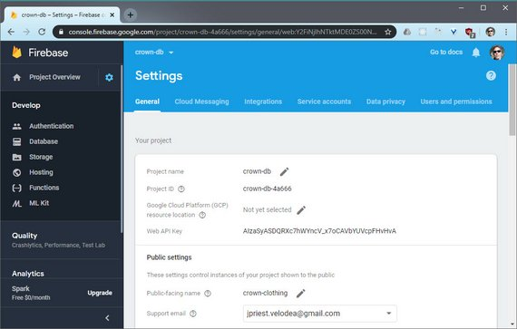](assets/images/r6d25a.jpg)<br>
<span class="center bold">Firebase UI</span>

The next phase of my React course had me setup and integrate Firebase Authentication.

[](assets/images/r6d25b.jpg)<br>
<span class="center bold">Integrated OAuth2 Authentication</span>

**Links:**
- My GitHub Repo - [Crown Clothing Repo](https://github.com/james-priest/crown-clothing)
- [Complete React Developer in 2019 (w/ Redux, Hooks, GraphQL)](https://www.udemy.com/complete-react-developer-zero-to-mastery/) - Neagoie & Zhang

---

## 24. E-commerce React Site
### Day 24: August 19, 2019 - Monday

**Project:** [Complete React Developer in 2019 (w/ Redux, Hooks, GraphQL)](https://www.udemy.com/complete-react-developer-zero-to-mastery/) - Neagoie & Zhang

[](assets/images/r6d24.jpg)<br>
<span class="center bold">E-commerce site Mock-up</span>

**Progress:**

Next I'm starting the large project for this React course. It has us build a complete e-commerce site with the following:

- Authentication
- Payment processing
- Backend data store

[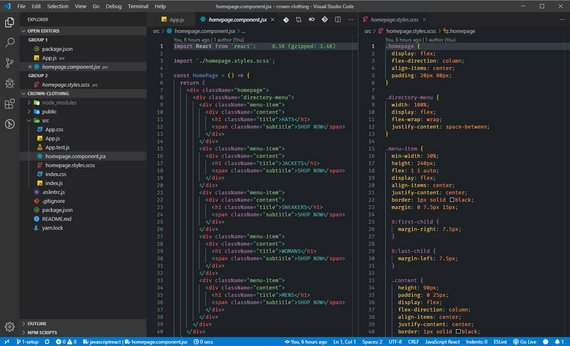](assets/images/r6d24a.jpg)<br>
<span class="center bold">Basic mockup code</span>

**Links:**
- My GitHub Repo - [Crown Clothing Repo](https://github.com/james-priest/crown-clothing)
- [Complete React Developer in 2019 (w/ Redux, Hooks, GraphQL)](https://www.udemy.com/complete-react-developer-zero-to-mastery/) - Neagoie & Zhang

---

## 23. Cats Rolodex Mini-App
### Day 23: August 17, 2019 - Saturday

**Project:** [Complete React Developer in 2019 (w/ Redux, Hooks, GraphQL)](https://www.udemy.com/complete-react-developer-zero-to-mastery/) - Neagoie & Zhang

[](assets/images/r6d23.jpg)<br>
<span class="center bold">Cats Rolodex Mini App</span>

**Progress:**

I completed the first mini app for the **React Basics** section.

This simple app does two separate async API calls and displays a list of names and images received from the response JSON files.

This was then deployed to GitHub Pages using the *gh-pages* CLI.

The app also uses

- props
- state
- lifecycle methods

[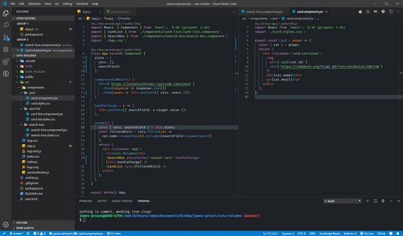](assets/images/r6d23a.jpg)<br>
<span class="center bold">VS Code</span>

**Links:**
- Live Demo - [Cats Rolodex](https://james-priest.github.io/cats-rolodex/)
- My GitHub Repo - [Cats Rolodex Repo](https://github.com/james-priest/cats-rolodex)
- [Complete React Developer in 2019 (w/ Redux, Hooks, GraphQL)](https://www.udemy.com/complete-react-developer-zero-to-mastery/) - Neagoie & Zhang

---

## 22. New React/Redux Mastery Course
### Day 22: August 16, 2019 - Friday

**Project:** [Complete React Developer in 2019 (w/ Redux, Hooks, GraphQL)](https://www.udemy.com/complete-react-developer-zero-to-mastery/) - Neagoie & Zhang

[](assets/images/r6d22.jpg)<br>
<span class="center bold">React/Redux course on Udemy</span>

**Progress:**

I started a new React/Redux course that covers the following topics.

| Redux | Hooks | GraphQL | Jest/Enzyme |
| Redux-Saga | ContextAPI | Stripe | Firebase |

I'm hoping this will help solidify some React/Redux concepts like:

- Use of pure functions for reducers
- Performance tuning
- Application & component organization

This first section of this course deals with **React Basics**. It teaches the fundamentals of React while building a simple Rolodex App to demonstrate these concepts.

[](assets/images/r6d22a.jpg)<br>
<span class="center bold">Cats Rolodex</span>

**Links:**
- [Complete React Developer in 2019 (w/ Redux, Hooks, GraphQL)](https://www.udemy.com/complete-react-developer-zero-to-mastery/) - Neagoie & Zhang
- My GitHub Repo - [Cats Rolodex](https://github.com/james-priest/cats-rolodex)

---

## 21. Storybook - Front End Workshop Environment
### Day 21: August 13, 2019 - Tuesday

**Project:** Practice Whiteboarding Algorithms + Data Structures

[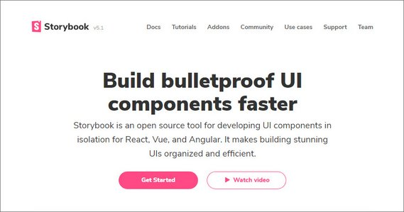](assets/images/r6d21.jpg)<br>
<span class="center bold">Storybook</span>

**Progress:**

I set out learn to about an open source tool called [Storybook](https://storybook.js.org).

Storybook is a Front End Workshop Environment that describes itself as a *UI component explorer for frontend developers*.

It's basically a set of packages that can be added to a React, Vue, or Angular application that allows you to develop components in isolation. Each component can then be viewed, catalogued, and tested outside of the constructs of the application these components are built for.

I went through their [Storybook for React Tutorial](https://www.learnstorybook.com/react/en/get-started/) and built out the following.

[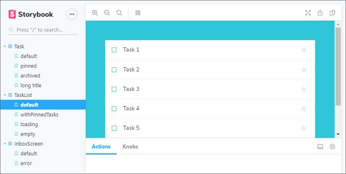](assets/images/r6d21a.jpg)<br>
<span class="center bold">Storybook UI</span>

This tool is implemented right within your React app's code by creating a storybook.js file for each component.  What Storybook provides is.

- Component explorer
- Styleguide generator
- Documentation site
- Playground, Sandbox, & UI library

**Take-away:** This is a great tool to document custom-built components that will be used as part of a larger-scale application.

It creates a UI framework for you to showcase and test each component which is suitable for stakeholders, designers, product managers, etc.

It also allows you to build out edge cases for each state of a given component.

**Links:**
- [Storybook.js.org](https://storybook.js.org) - Docs, Guide, & Tool
- Chroma Post - [The Storybook Workflow](https://blog.hichroma.com/the-delightful-storybook-workflow-b322b76fd07) - Dominic Nguyen
- Chroma Post - [UI component explorers](https://blog.hichroma.com/the-crucial-tool-for-modern-frontend-engineers-fb849b06187a) - Dominic Nguyen
- Chroma Post - [Component-Driven Development](https://blog.hichroma.com/component-driven-development-ce1109d56c8e) - Tom Coleman
- BradFrost.com - [a frontend workshop environment](http://bradfrost.com/blog/post/a-frontend-workshop-environment/) - Brad Frost
- BradFrost.com - [frontend design, react, and a bridge over the great divide](http://bradfrost.com/blog/post/frontend-design-react-and-a-bridge-over-the-great-divide/) - Brad Frost
- CSS Tricks Post - [The Great Divide](https://css-tricks.com/the-great-divide/) - Chris Coyier
- Book - [Atomic Design](http://atomicdesign.bradfrost.com) - Brad Frost

---

## 20. Data Structures - Binary Search Tree
### Day 20: August 8, 2019 - Thursday

**Project:** Practice Whiteboarding Algorithms + Data Structures

[](assets/images/r6d20.jpg)<br>
<span class="center bold">Binary Search Tree</span>

**Progress:**

I continued on my Udemy course:

- [The Coding Interview Bootcamp: Algorithms + Data Structures](https://www.udemy.com/coding-interview-bootcamp-algorithms-and-data-structure) by Stephen Grider.

This next set of lessons focused on using Binary Search Trees.

Each node has a value, data, or key and have Left and Right node who's values are less than and greater than the main value, respectively.

[](assets/images/r6d20a.jpg)<br>
<span class="center bold">Binary Search Tree Node</span>

The Node implementation uses recursion for both the *insert* and *contains* methods.

```js
class Node {
  constructor(data) {
    this.data = data;
    this.left = null;
    this.right = null;
  }
  insert(data) {
    if (data < this.data && this.left) {
      this.left.insert(data);
    } else if (data < this.data) {
      this.left = new Node(data);
    } else if (data > this.data && this.right) {
      this.right.insert(data);
    } else if (data > this.data) {
      this.right = new Node(data);
    }
  }
  contains(data) {
    if (data === this.data) {
      return this;
    }

    if (data < this.data && this.left) {
      return this.left.contains(data);
    } else if (data > this.data && this.right) {
      return this.right.contains(data);
    } else {
      return null;
    }
  }
}
```

**Links:**
- [The Coding Interview Bootcamp: Algorithms + Data Structures](https://www.udemy.com/coding-interview-bootcamp-algorithms-and-data-structure) by Stephen Grider
- My GitHub Repo - [Coding Interview Bootcamp](https://github.com/james-priest/coding-interview-bootcamp)

---

## 19. Data Structures - Tree Traversal
### Day 19: August 4, 2019 - Sunday

**Project:** Practice Whiteboarding Algorithms + Data Structures

[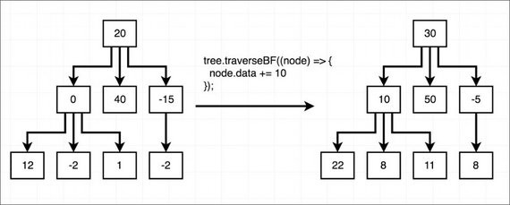](assets/images/r6d19.jpg)<br>
<span class="center bold">Tree Traversal</span>

**Progress:**

I continued on my Udemy course:

- [The Coding Interview Bootcamp: Algorithms + Data Structures](https://www.udemy.com/coding-interview-bootcamp-algorithms-and-data-structure) by Stephen Grider.

Today I learned how to implement the code for both a tree node and a tree class.

The node needs to have an *add* and *remove* method while the Tree class contains the *root* property and the traversal methods.

[](assets/images/r6d19a.jpg)<br>
<span class="center bold">Tree class</span>

```js
class Node {
  constructor(data) {
    this.data = data;
    this.children = [];
  }
  add(data) {
    const node = new Node(data);
    this.children.push(node);
  }
  remove(data) {
    this.children = this.children.filter(node => node.data !== data);
  }
}

class Tree {
  constructor() {
    this.root = null;
  }
  traverseBF(fn) {
    const flat = [this.root];

    while (flat.length) {
      const node = flat.shift();

      // method #1
      // for (const child of node.children) {
      //   flat.push(child);
      // }

      // method #2
      // node.children.forEach(child => flat.push(child));

      // method #3
      flat.push(...node.children);

      fn(node);
    }
  }
  traverseDF(fn) {
    const flat = [this.root];

    while (flat.length) {
      const node = flat.shift();

      flat.unshift(...node.children);

      fn(node);
    }
  }
}
```

The tree can then be created and traversed with the following code.

```js
const letters = [];
const t = new Tree();
t.root = new Node('a');
t.root.add('b');
t.root.add('c');
t.root.children[0].add('d');

t.traverseBF(node => {
  letters.push(node.data);
});

console.log(letters); // ['a', 'b', 'c', 'd']
```

**Links:**
- [The Coding Interview Bootcamp: Algorithms + Data Structures](https://www.udemy.com/coding-interview-bootcamp-algorithms-and-data-structure) by Stephen Grider
- My GitHub Repo - [Coding Interview Bootcamp](https://github.com/james-priest/coding-interview-bootcamp)

---

## 18. Data Structures - Trees
### Day 18: August 3, 2019 - Saturday

**Project:** Practice Whiteboarding Algorithms + Data Structures

[](assets/images/r6d18.jpg)<br>
<span class="center bold">Tree Data Structure</span>

**Progress:**

I continued on my Udemy course:

- [The Coding Interview Bootcamp: Algorithms + Data Structures](https://www.udemy.com/coding-interview-bootcamp-algorithms-and-data-structure) by Stephen Grider.

I learned about the tree data structure and all the terminology around its various elements.

- **parent** - node above
- **children** - array of nodes "owned" by parent
- **siblings** - nodes in that same children array

Iterating through a tree is called **traversal**. There are different orders of traversal including:

- Breadth-First - starts at the top and goes horizontal left to right

[](assets/images/r6d18a.jpg)<br>
<span class="center bold">Breadth-First Traversal</span>

- Depth-First - Goes top to bottom, zig zagging from left ot right.

[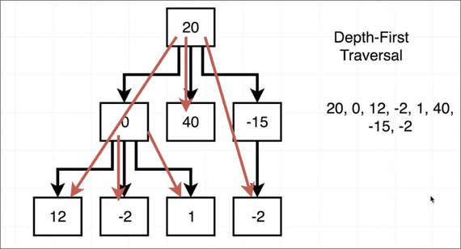](assets/images/r6d18b.jpg)<br>
<span class="center bold">Depth-First Traversal</span>

The data in a node can consist of anything (e.g. number, string, array, object, etc.). There are many use-cases where tree data structures are best suited to accomplish a task including many hierarchical relationships.

**Links:**
- [The Coding Interview Bootcamp: Algorithms + Data Structures](https://www.udemy.com/coding-interview-bootcamp-algorithms-and-data-structure) by Stephen Grider
- My GitHub Repo - [Coding Interview Bootcamp](https://github.com/james-priest/coding-interview-bootcamp)

---

## 17. Interviews & Job Offers
### Day 17: August 1, 2019 - Thursday

**Project:** Getting Hired

[](assets/images/r6d17a.jpg)

**Progress:**

I've been deep in the world of tech interviews for the last 4 weeks. For anyone not familiar with these, here's a rough chronological order.

1. Screener interview with a recruiter (15-30 min)
2. Behavioral interview usually with hiring manager (30-60 min)
3. Technical skills assessment (one of these)
   - timed test (60 min)
   - live coding (60 min)
   - take home project (3-5 days)
4. In-person technical interview with whiteboarding (1-4 hours)

[](assets/images/r6d17.jpg)

If you pass each of these then an offer will be made. That process goes like this:
1. Initial offer made
2. You accept
3. Formal offer drawn up
4. Background check - can consist of: local, state, federal, credit score, online activity, social media, judgments, liens, lawsuits, arrests, bankruptcies, etc.

If you pass all this then you are officially **hired**!

Each one of these steps acts as a gatekeeper so if you don't pass one you don't get to progress to the next.

The whole process can take weeks for a single position. Managing this for multiple job openings can be overwhelming and is a full-time job by itself.

Here's how things went for me over the last 4 weeks.

- Submitted resume to about 80 jobs openings
- Had 15-20 screener interviews
- 10 Behavioral interviews
- 8 skills assessments
- 4 job offers

I'm fortunate because I have a long work history and lots of experience in web development.

For new developers the breakdown may go like this:

- Submit resume to 100 job openings
- Get 10 responses
- Do 5 behavioral interviews
- Get through 3 tech assessments
- Get 1 job offer

The key is not to get discouraged. The reward is well worth the effort once you do find that place which is willing to bring you on board.

Also, it doesn't need to be your #1 choice of company to work for when you're just getting started in your career. Sometimes we need to work a less than ideal job for 6 months or a year in order to get that experience. Once you gain that experience then companies will often bid against each other to win you over.

For me it was crazy because I had reached the "offer stage"  until the last few days of the last week. Then they all came in within 3 days of each other. Each company was also willing to raise their offer in response to the previous one. Another universal truth is that once one company is interested in you, then they are all interested in you.

The salaries spanned a broad range with the most moderate (lowest) salaries being offered by the places that seemed to provide the best work environment. The crumby places will often lure you in with high salary offers only to end up working you to death.

Here's how I separated the 4 places that offered me a job.

**Software companies** (This is where you want to work)

- **Company 1:** Software company with a SaaS product - Best employee perks (game room, free snacks, catered lunch, moderate pace, stock options, high value on employees)
- **Company 2:** Services company with e-commerce website - Great perks (game room, fully stocked kitchen, flex time, remote days, top equipment, stock options, high value on employees)

**Ad Agencies / Production Companies** (Don't work here)

- **Company 3:** Digital Publishing Company - No perks (On call 24/7; dev, maintenance, & support are jobs of the dev team; office job with little down time; reasonable pace when publishing system works, high stress when it doesn't)
- **Company 4:** Ad Agency with high-volume production work - High salary, high stress, few perks - Office setup like a boiler room; high value on client / low value on devs; burn-out and low morale is common as well as outright deception by those in management according to anonymous postings by employees (see below); no loyalty towards employees and if the contract doesn't get renewed, staff gets laid off.

I almost made the horrible mistake of accepting a position for lots of money only to read [the most horrible company reviews](https://www.glassdoor.com/Reviews/Elephant-Reviews-E1486214.htm).

I quickly broke our agreement and walked away before I got sucked in. The biggest red flag was that the [recruiting company](https://www.roberthalf.com/) lied to me about the negotiated terms of the contract. I was specific and clear that I would only sign if we had consensus and agreement on two points:

- The position needs to be a permanent hire
- The salary needs to be $xxx amount

The recruiters negotiated with the hiring company and then informed me it was agreed upon. They said we had a deal on both points. The hiring company then refused to put any of this in writing but proceeded to give me verbal assurances once it was time to sign. Furthermore, they claimed the recruiters made these commitments without their consent.

I ended up accepting an offer at a software company for 35k less per year but this is a place where the employees [have nothing but good things to say about the company](https://www.glassdoor.com/Reviews/Everbridge-Pasadena-Reviews-EI_IE361320.0,10_IL.11,19_IC1146850.htm).

Having worked at an agency in the past, I feel like I dodged a bullet and am finally going to get to work at a place that values its employees above all else.

The final thought I can leave anyone with is to make sure to do your homework. Read company reviews on Glassdoor and look at LinkedIn profiles of people that work there to see how long they've chosen to stay with that company. That is perhaps one of the most telling indicators of employee contentment.

---

## 16. Data Structures - More Linked List Methods
### Day 16: July 27, 2019 - Saturday

**Project:** Practice Whiteboarding Algorithms + Data Structures

[](assets/images/r6d16.jpg)<br>
<span class="center bold">getAt() method diagram</span>

**Progress:**

I continued on my Udemy course:

- [The Coding Interview Bootcamp: Algorithms + Data Structures](https://www.udemy.com/coding-interview-bootcamp-algorithms-and-data-structure) by Stephen Grider.

I completed a dozen methods which are part of the LinkedList class that allows manipulation of the list.

Once complete, we looked at how to condense the methods through code reuse.

[](assets/images/r6d16a.jpg)<br>
<span class="center bold">Method consolidation</span>

Lastly, the course required us to implement iterator methods.

- forEach()
- for...of

`for...of` required the use of generators.

**Links:**
- [The Coding Interview Bootcamp: Algorithms + Data Structures](https://www.udemy.com/coding-interview-bootcamp-algorithms-and-data-structure) by Stephen Grider
- My GitHub Repo - [Coding Interview Bootcamp](https://github.com/james-priest/coding-interview-bootcamp)

---

## 15. Data Structures - Linked Lists
### Day 15: July 26, 2019 - Friday

**Project:** Practice Whiteboarding Algorithms + Data Structures

[](assets/images/r6d15.jpg)<br>
<span class="center bold">Linked List Attributes</span>

**Progress:**

I continued on my Udemy course:

- [The Coding Interview Bootcamp: Algorithms + Data Structures](https://www.udemy.com/coding-interview-bootcamp-algorithms-and-data-structure) by Stephen Grider.

This lesson got into the world of linked lists. It's a beautiful data structure that allows you to chain data elements together.

[](assets/images/r6d15a.jpg)<br>
<span class="center bold">Linked List Nodes</span>

Nodes are instances of the Nodes class and are objects consisting of two properties

- data - data associated with this node
- next - a pointer to the next node or null for last node

[](assets/images/r6d15c.jpg)<br>
<span class="center bold">Node Chaining</span>

Next we can create a LinkedList Class to manage our list.

[](assets/images/r6d15b.jpg)<br>
<span class="center bold">LinkedList Class</span>

The LinkedList class has a single property and multiple methods for manipulating the lists.

- head (property) - first node
- insertFirst()
- size()
- getFirst()
- getLast()
- clear()
- removeFirst()
- removeLast()
- insertLast()
- *[additional methods...]*

**Links:**
- [The Coding Interview Bootcamp: Algorithms + Data Structures](https://www.udemy.com/coding-interview-bootcamp-algorithms-and-data-structure) by Stephen Grider
- My GitHub Repo - [Coding Interview Bootcamp](https://github.com/james-priest/coding-interview-bootcamp)

---

## 14. Data Structures - Stack
### Day 14: July 25, 2019 - Thursday

**Project:** Practice Whiteboarding Algorithms + Data Structures

[](assets/images/r6d14.jpg)<br>
<span class="center bold">Stack Methods</span>

**Progress:**

I continued on my Udemy course:

- [The Coding Interview Bootcamp: Algorithms + Data Structures](https://www.udemy.com/coding-interview-bootcamp-algorithms-and-data-structure) by Stephen Grider.

This lesson covered creating a class that acts as a wrapper to array which only allows the following methods.

- push()
- pop()
- peek()

[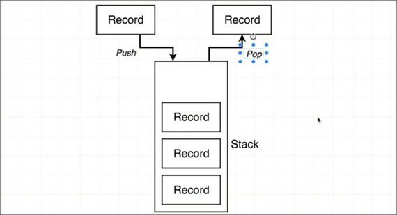](assets/images/r6d14a.jpg)<br>
<span class="center bold">Stack process</span>

**Links:**
- [The Coding Interview Bootcamp: Algorithms + Data Structures](https://www.udemy.com/coding-interview-bootcamp-algorithms-and-data-structure) by Stephen Grider

---

## 13. Data Structures - Queue
### Day 13: July 24, 2019 - Wednesday

**Project:** Practice Whiteboarding Algorithms + Data Structures

[](assets/images/r6d13.jpg)<br>
<span class="center bold">Data Structures</span>

**Progress:**

I continued on my Udemy course:

- [The Coding Interview Bootcamp: Algorithms + Data Structures](https://www.udemy.com/coding-interview-bootcamp-algorithms-and-data-structure) by Stephen Grider.

The lesson started covering data structures and how to create these through code and in memory to handle various schemas.

[](assets/images/r6d13a.jpg)<br>
<span class="center bold">Queue</span>

Although JavaScript has optimized methods on the array object to handle data structures, we may be asked to code these in an interview.

This can be accomplished by creating a class and wrapping the necessary array methods.

[](assets/images/r6d13b.jpg)<br>
<span class="center bold">Queue Class</span>

**Links:**
- [The Coding Interview Bootcamp: Algorithms + Data Structures](https://www.udemy.com/coding-interview-bootcamp-algorithms-and-data-structure) by Stephen Grider

---

## 12. Runtime Complexity
### Day 12: July 23, 2019 - Tuesday

**Project:** Practice Whiteboarding Algorithms + Data Structures

[](assets/images/r6d12.jpg)<br>
<span class="center bold">Runtime Complexity</span>

**Progress:**

I continued on my Udemy course:

- [The Coding Interview Bootcamp: Algorithms + Data Structures](https://www.udemy.com/coding-interview-bootcamp-algorithms-and-data-structure) by Stephen Grider.

The lessons now cover subjects like:

- Runtime complexity
- Big O Notation
- Memoization

Reducing runtime complexity can be accomplished through memoization. This is done by having a wrapper function return cached results of a function call without having to invoke that function again.

[](assets/images/r6d12a.jpg)<br>
<span class="center bold">Memoization</span>

**Links:**
- [The Coding Interview Bootcamp: Algorithms + Data Structures](https://www.udemy.com/coding-interview-bootcamp-algorithms-and-data-structure) by Stephen Grider

---

## 11. Recursion & Matrix Algorithms
### Day 11: July 22, 2019 - Monday

**Project:** Practice Whiteboarding Algorithms + Data Structures

[](assets/images/r6d11.jpg)<br>
<span class="center bold">Spiral Matrix</span>

**Progress:**

I continued on my Udemy course:

- [The Coding Interview Bootcamp: Algorithms + Data Structures](https://www.udemy.com/coding-interview-bootcamp-algorithms-and-data-structure) by Stephen Grider.

Now we're getting into some more complex algorithms including

- Nested Loops
- Recursion
- Spiral Matrix

```js
// --- Directions
// Write a function that accepts an integer N
// and returns a NxN spiral matrix.
// --- Examples
//   matrix(2)
//     [[1, 2],
//     [4, 3]]
//   matrix(3)
//     [[1, 2, 3],
//     [8, 9, 4],
//     [7, 6, 5]]
//  matrix(4)
//     [[1,   2,  3, 4],
//     [12, 13, 14, 5],
//     [11, 16, 15, 6],
//     [10,  9,  8, 7]]

function matrix(n) {
  // build nested arrays first
  const results = [];
  for (let i = 0; i < n; i++) {
    results.push([]);
  }
  let counter = 1;
  let startRow = 0,
    endRow = n - 1,
    startCol = 0,
    endCol = n - 1;

  while (startCol <= endCol && startRow <= endRow) {
    //  Top row
    for (let i = 0; i <= endCol; i++) {
      results[startCol][i] = counter++;
    }
    startRow++;

    // Right column
    for (let i = startRow; i <= endRow; i++) {
      results[i][endCol] = counter++;
    }
    endCol--;

    // Bottom row
    for (let i = endCol; i >= startCol; i--) {
      results[endRow][i] = counter++;
    }
    endRow--;

    // Left side
    for (let i = endRow; i >= startRow; i--) {
      results[i][startCol] = counter++;
    }
    startCol++;
  }

  return results;
}
```

The formula for building recursion consists of a few key steps.

[](assets/images/r6d11a.jpg)<br>
<span class="center bold">Recursion Steps</span>

**Links:**
- [The Coding Interview Bootcamp: Algorithms + Data Structures](https://www.udemy.com/coding-interview-bootcamp-algorithms-and-data-structure) by Stephen Grider

---

## 10. Array & String Algorithms
### Day 10: July 20, 2019 - Saturday

**Project:** Practice Whiteboarding Algorithms + Data Structures

[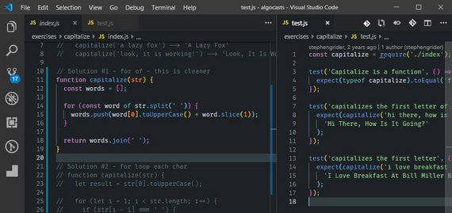](assets/images/r6d10.jpg)<br>
<span class="center bold">Capitalize every word</span>

**Progress:**

I continued on my Udemy course:

- [The Coding Interview Bootcamp: Algorithms + Data Structures](https://www.udemy.com/coding-interview-bootcamp-algorithms-and-data-structure) by Stephen Grider.

I reviewed yesterday's algorithms and worked on a few new ones.

- Capitalize
- More Anagrams
- Object Character Maps

[](assets/images/r6d10a.jpg)<br>
<span class="center bold">Questions requiring a CharMap</span>

Any of these require that we create an object whose keys are the characters and the value is the number of occurrences.

[](assets/images/r6d10b.jpg)<br>
<span class="center bold">Anagram use of CharMap</span>

**Links:**
- [The Coding Interview Bootcamp: Algorithms + Data Structures](https://www.udemy.com/coding-interview-bootcamp-algorithms-and-data-structure) by Stephen Grider

---

## 9. Beginning Algorithms
### Day 9: July 19, 2019 - Friday

**Project:** Practice Whiteboarding Algorithms + Data Structures

[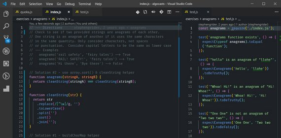](assets/images/r6d9.jpg)<br>
<span class="center bold">Anagrams</span>

**Progress:**

I continued on my Udemy course:

- [The Coding Interview Bootcamp: Algorithms + Data Structures](https://www.udemy.com/coding-interview-bootcamp-algorithms-and-data-structure) by Stephen Grider.

I learned the following algorithms & techniques.

- Reverse a string
- Reverse a number
- Palindrome
- Anagrams
- array Chunking
- Fizzbuzz
- Character Maps

[](assets/images/r6d9a.jpg)<br>
<span class="center bold">Create a CharMap</span>

**Links:**
- [The Coding Interview Bootcamp: Algorithms + Data Structures](https://www.udemy.com/coding-interview-bootcamp-algorithms-and-data-structure) by Stephen Grider

---

## 8. The Coding Interview Bootcamp - Grider
### Day 8: July 17, 2019 - Wednesday

**Project:** Practice Whiteboarding Algorithms + Data Structures

[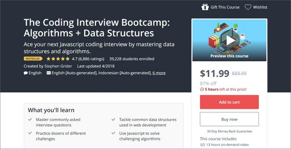](assets/images/r6d8.jpg)<br>
<span class="center bold">Course Overview</span>

**Progress:**

Today I started a Udemy course called:

- [The Coding Interview Bootcamp: Algorithms + Data Structures](https://www.udemy.com/coding-interview-bootcamp-algorithms-and-data-structure) by Stephen Grider.

This is an awesome course that specifically prepares you to be whiteboarded.  Beyond that it also gives you tons of practice solving everyday algorithmic challenges.

Now that I've done a few interviews and technical assessments, I have a sense of what's really needed to nail the code challenges so that you are more likely to get that job offer.

This course does just that by focusing on the techniques necessary to problem solve on the spot. It also give you the tools to look at each problem as a set of steps that can be decomposed into manageable chunks.

[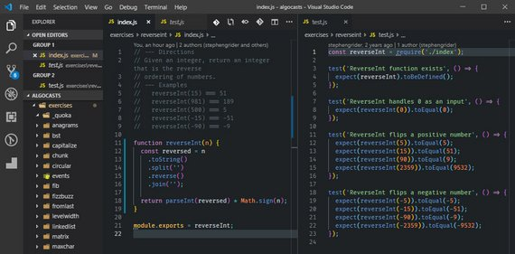](assets/images/r6d8a.jpg)<br>
<span class="center bold">Typical Code Exercise</span>

**Links:**
- [The Coding Interview Bootcamp: Algorithms + Data Structures](https://www.udemy.com/coding-interview-bootcamp-algorithms-and-data-structure) by Stephen Grider

---

## 7. Learn Teach Code Meetup
### Day 7: July 16, 2019 - Tuesday

**Project:** Networking

[](assets/images/r6d7.jpg)<br>
<span class="center bold">Learn Teach Code Meetup</span>

**Progress:**

Today I went to my weekly Learn Teach Code Meetup ([https://learnteachcode.org/](https://learnteachcode.org/)).

This has been a great way to get out and network with other developers who want to exchange ideas, code together, get help, or discuss job hunting.  

Most folks in the group are training to level up or are in the process of trying to find a job.

It's tough because every job wants 2-3 years of [fill in the blank] experience. This makes it super tough to break into for anyone who's just mastering a new technology or skill.

On a related note, I met up with [VJ Hawkins](https://twitter.com/vjhawkins1), one of my [#100DaysOfCode](https://twitter.com/search?q=%23100DaysOfCode&src=tyah) Twitter fam. In fact, this was the first time I've had a chance to meet one of my fellow [#100DaysOfCode](https://twitter.com/search?q=%23100DaysOfCode&src=tyah) crew IRL.

[](assets/images/r6d7a.jpg)<br>
<span class="center bold">VJ & Myself</span>

Had a great time discussing the struggle of securing a tech job in this highly competitive space.  

**Links:**
- [Learn Teach Code](https://learnteachcode.org/)
- [Burbank Coding Study Group Meetup](https://www.meetup.com/LearnTeachCode/events/262955378/)

---

## 6. On-Site Technical Interview @ Honey
### Day 6: July 15, 2019 - Monday

**Project:** Technical Interview @ Honey

[](assets/images/r6d6.jpg)<br>
<span class="center bold">Honey Headquarters</span>

**Progress:**

Today I had an amazing experience. I interviewed for 5 straight hours at a company called Honey. I was given a tour, learned about the company, and was whiteboarded thoroughly.

The technical skills assessments covered four distinct areas.

- HTML/CSS
- JavaScript ES6
- React.js & Frameworks
- Interactive Design

Each one took about an hour and was guided along by either one or two engineers.

A problem was presented in each area and the task was to do the following:

- Understand the problem by asking clarifying questions.
- Determine any edge case scenarios.
- Code a solution to solve the problem.

The one thing that became abundantly clear was that everyone at this company was really smart. The level of expertise and knowledge was exceptional which helped fuel my excitement at the prospect of working with these folks.

Beyond that, the company culture is one of diversity, inclusion, and a passion to provide savings to customers on a massive scale.

Now I wait to hear back and see if I made the cut and if there was a good fit.

Oh, and I got this cool swag bag!

[](assets/images/r6d6a.jpg)<br>
<span class="center bold">Honey Swag Bag</span>

**Links:**
- [Build In LA - 100 Best Place to Work in Los Angeles 2019](https://www.builtinla.com/companies/best-places-to-work-los_angeles-2019) (Honey is #1)
- [Build in LA - Honey company profile](https://www.builtinla.com/company/honey)

---

## 5. Static Site Generators
### Day 5: July 13, 2019 - Saturday

**Project:** R & D

[](assets/images/r6d5.jpg)<br>
<span class="center bold">Static Site Generators</span>

**Progress:**

I spent some time digging into the world of [Static Site Generators (SSGs)](https://www.staticgen.com/about).

SSGs are solutions built on top of the [JAMstack](https://jamstack.org/) . JAMStack is a new way of architecting sites that relies on JavaScript, APIs, & prerendered Markup served without webservers.

Instead these are served from CDNs, Git repositories, or Static Site Generator Hosting like [Netlify](https://www.netlify.com/).

> When we talk about “The Stack,” we no longer talk about operating systems, specific web servers, backend programming languages, or databases.
>
> The JAMstack is not about specific technologies. It’s a new way of building websites and apps that delivers better performance, higher security, lower cost of scaling, and a better developer experience.

Examples of SSGs are:

- Next.js
- Jekyll
- Hugo
- Gatsby
- React Static

They can easily be deployed to Netlify from a GitHub repo. In fact, it's even easier than that.  Netlify built a [1-click deploy](https://www.staticgen.com/) that creates a repo and deploys a static starter site in one shot.

[](assets/images/r6d5a.jpg)<br>
<span class="center bold">Static Site Generators</span>

Check out the links below for more information.

**Links:**
- [StaticGen](https://www.staticgen.com/) - A List of Static Site Generators for JAMstack Sites.
- [StaticGen - About](https://www.staticgen.com/about) - What is a Static Site Generator?
- [Netlify](https://www.netlify.com/) - Static Site Hosting along with continuous deployment, serverless functions, etc.

---

## 4. React/Redux Skills Test
### Day 4: July 12, 2019 - Friday

**Project:** Technical Interview

[](assets/images/r6d4.jpg)<br>
<span class="center bold">Redux actions</span>

**Progress:**

I took a few days to recreate the take-home test I was given and build it using React and Redux.

This was a good exercise in using a centralized state management solution a provided practice with the following:

- Action creators
- Reducers
- Async Redux with Redux Thunk
- Promises
- Async & Await

Also added spinners to indicate Async calls.

[](assets/images/r6d4a.jpg)<br>
<span class="center bold">Async spinners</span>

**Links:**
- GitHub - [Vicky's Flowers React Redux](https://github.com/james-priest/vickys-flowers-react-redux)
- Demo of Vanilla JS, DOM, & CSS version - [https://vickys-flowers.netlify.com/](https://vickys-flowers.netlify.com/)

---

## 3. Technical Test Fail
### Day 3: July 10, 2019 - Wednesday

**Project:** Technical Interview

[](assets/images/r6d3.jpg)<br>
<span class="center bold">Test Score</span>

**Progress:**

I took a timed technical test as part of the interview process for a job today. It covered:

- JavaScript
- React.js
- Node.js
- HTML/CSS/DOM

I'm pretty good at all these things but did horribly on this test. The frustrating part was that I over-thought each and every problem.

Watching the time tick down as I struggled to debug and work the problems in my editor didn't help either.

Once the test was done, I reviewed the problems. In most cases the solutions turned out to be so simple and straight-forward. These were things like missing parenthesis or out of order function calls.

The moral of the story is to breathe and look for the obvious issues first. I was thinking I had to refactor and utilize obscure language constructs, but this often wasn't the case.

Here are a couple samples...

[](assets/images/r6d3a.jpg)<br>
<span class="center bold">Problem 1</span>

[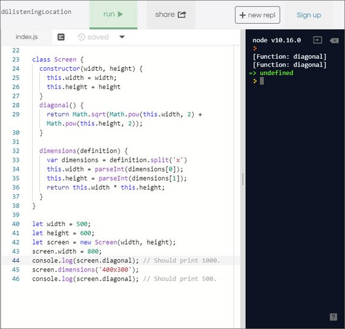](assets/images/r6d3b.jpg)<br>
<span class="center bold">Problem 2</span>

<!-- **Links:**
- GitHub - [Vicky's Flowers](https://github.com/james-priest/vickys-flowers)
- Live Site - [https://vickys-flowers.netlify.com/](https://vickys-flowers.netlify.com/) -->

---

## 2. Take-home Test
### Day 2: July 8, 2019 - Monday

**Project:** Technical Interview

[](assets/images/r6d2a.jpg)<br>
<span class="center bold">Mock-up</span>

**Progress:**

I was given a take-home test by a company I've been interviewing with. This was in lieu of a whiteboard session or live coding technical interview . The role is for Sr. Front-End Engineer.

The assignment was to take a comp and build a fully functional and responsive e-commerce page.

It needed to use a build system and was reviewed for:

- Organization
- Readability of code
- Pixel perfect recreation of the mockup
- End product results

The other elements it needed to have were:

- Drag and drop capability
- Dynamic update of shopping cart
- Randomized values in drop-down select inputs

The instructions for the assignment are here: [vickys-flowers/docs/INSTRUCTIONS.md](https://github.com/james-priest/vickys-flowers/blob/master/docs/INSTRUCTIONS.md).

**Links:**
- GitHub - [Vicky's Flowers](https://github.com/james-priest/vickys-flowers)
- Live Site - [https://vickys-flowers.netlify.com/](https://vickys-flowers.netlify.com/)

---

## 1. JAMstack Discovered
### Day 1: June 29, 2019 - Saturday

**Project:** JAMstack Research

[](assets/images/r6d1.jpg)<br>
<span class="center bold">Stack History</span>

**Progress:**

JAMstack is the newest stack in the evolution of development for the web. It represents a leap forward in in the following areas.

- Improved scaling
- Heightened security
- Accelerated load times
- Better developer experience:

I to does this by decoupling the CMS content (data) from the website (presentation & structure).

[](assets/images/r6d1a.jpg)<br>
<span class="center bold">Stacks Compared</span>

This allows the website to be statically generated. It pulls in data through API calls. The static site can then be served by CDNs (Content Delivery Network) without the need for a server.

**Links:**
- Medium - [The JAMstack, It's Pretty Sweet](https://medium.com/memory-leak/the-jamstack-its-pretty-sweet-e0834e4e6bb7)
- Snipcart Blog - [JAMstack in 2019](https://snipcart.com/blog/jamstack)

---
